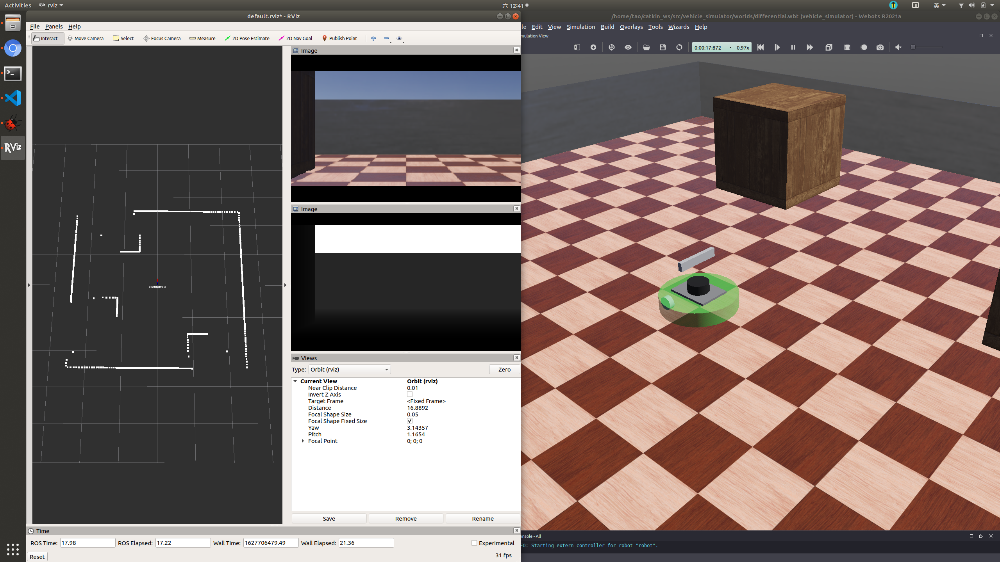

# Vehicle Simulator
## Requirements
+ Ubuntu 18.04
+ ROS Melodic
## Prerequisites
+ download webots_2021a_amd64.deb from https://github.com/cyberbotics/webots/releases/tag/R2021a
+ install webots and other packages
```Bash
$ sudo dpkg -i webots_2021a_amd64.deb
$ sudo echo "export WEBOTS_HOME=/usr/local/webots" >> ~/.bashrc
$ source ~/.bashrc
$ sudo apt-get isntall ros-melodic-webots-ros
$ sudo apt-get isntall ros-melodic-joy
```
## Build
```Bash
$ cd ~/catkin_ws/src
$ git clone https://github.com/TaoYibo1866/vehicle_simulator.git
$ cd ~/catkin_ws
$ catkin_make
```
## Run
+ Mecanum Scene (joystick control only tested on Logitech F710)
```Bash
$ roslaunch vehicle_simulator webots_mecanum.launch
```

+ Differential Scene (joystick control only tested on Logitech F710)
```Bash
$ roslaunch vehicle_simulator webots_differential.launch
```
